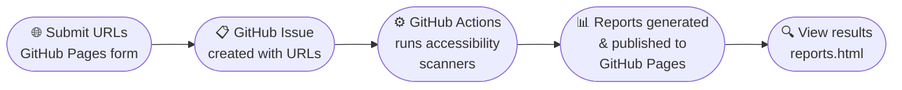

# Open Scans

[](https://www.gnu.org/licenses/agpl-3.0)
[](https://github.com/mgifford/open-scans/actions/workflows/deploy-pages.yml)
[](https://github.com/mgifford/open-scans/actions/workflows/scan-request.yml)
[](https://github.com/mgifford/open-scans/actions/workflows/scan-issue-queue.yml)

Issue-driven accessibility scanning using GitHub Pages and GitHub Actions. This project was inspired by [Oobee](https://github.com/GovTechSG/oobee) a project of [GovTech Singapore](https://www.tech.gov.sg/).

**Live site**: [https://mgifford.github.io/open-scans/](https://mgifford.github.io/open-scans/)  
**Reports**: [https://mgifford.github.io/open-scans/reports.html](https://mgifford.github.io/open-scans/reports.html)

---

## Table of Contents

- [What it is](#what-it-is)
- [Who this is for](#who-this-is-for)
- [How it works](#how-it-works)
- [Quick Start](#quick-start)
- [Choose Scanning Engines](#choose-scanning-engines)
- [View Scan Results](#view-scan-results)
- [Managing Your Scans](#managing-your-scans)
- [Scanning Triggers](#scanning-triggers)
- [Security & Privacy](#security--privacy)
- [Troubleshooting](#troubleshooting)
- [Architecture](#architecture)
- [Configuration](#configuration)
- [Development](#development)
- [Documentation](#documentation)
- [Current Status](#current-status)
- [AI Disclosure](#ai-disclosure)
- [License](#license)

---

## What it is

- Accepts URL batches from a GitHub Pages form
- Creates scan-request GitHub issues
- Runs multi-engine accessibility scans in GitHub Actions
- Publishes comparison-ready results to GitHub Pages

## Who this is for

- **Content and design teams** who want batch accessibility scans without standing up infrastructure
- **Accessibility practitioners** who want multi-engine comparisons (axe, ALFA, IBM Equal Access, and more) over time
- **Developers and DevOps teams** who want an issue-driven scanning pipeline built on GitHub Actions
- **Anyone** who needs recurring, scheduled accessibility monitoring of publicly accessible URLs

## How it works



1. **Submit** — Paste your URLs into the form at the [GitHub Pages site](https://mgifford.github.io/open-scans/)
2. **Issue created** — The form pre-fills a GitHub issue; submitting it triggers the scan pipeline
3. **Actions scan** — GitHub Actions runs the selected accessibility engines against each URL
4. **Reports published** — Scan results are committed back to the repository and published to GitHub Pages
5. **View results** — Browse all completed scans at the [Reports page](https://mgifford.github.io/open-scans/reports.html)

## Quick Start

### Submit Your Scan in 5 Minutes

1. **Prepare your URLs**: Gather the web pages you want to scan (recommended: 100–150 URLs per batch)
2. **Submit your scan**: Go to [https://mgifford.github.io/open-scans/](https://mgifford.github.io/open-scans/)
   - Enter a descriptive title for your scan
   - Paste your URLs (one per line or comma-separated)
   - Click "Create Scan Request" — this creates a GitHub issue that triggers the scan
3. **Wait for results**: Scans typically complete in 30–60 minutes depending on the number of URLs
4. **View your report**: Check [https://mgifford.github.io/open-scans/reports.html](https://mgifford.github.io/open-scans/reports.html) for your completed scan results

### Integration with Top Task Finder

If you're using the [Top Task Finder](https://mgifford.github.io/top-task-finder/) to identify your most important pages, open-scans is the perfect next step:

1. **Identify your top tasks**: Use the Top Task Finder to determine which pages are most critical for your users
2. **Export your URLs**: Get the list of URLs corresponding to your top tasks
3. **Scan for accessibility**: Paste those URLs into open-scans to check for accessibility issues
4. **Prioritize fixes**: Focus on fixing accessibility issues on your most important pages first

## Choose Scanning Engines

By default, **axe** plus one randomly selected engine run for a balanced result. Use `ALL` to run all five engines.

### Available Engines

| Engine | Keyword | Description |
| :--- | :--- | :--- |
| axe-core | `AXE` | Deque's industry-standard accessibility testing engine |
| Siteimprove ALFA | `ALFA` | Siteimprove's open-source, ACT-rules-based engine |
| IBM Equal Access | `EQUALACCESS` | IBM's comprehensive accessibility checker |
| AccessLint | `ACCESSLINT` | Automated accessibility testing tool |
| QualWeb | `QUALWEB` | University of Lisbon's WCAG and ACT Rules evaluator |

### Specifying Engines

**Option 1 — In the issue title**: include one or more engine keywords (removed automatically from the scan title):

```
SCAN: AXE ALFA Homepage accessibility check
SCAN: ALL Complete accessibility audit
```

**Option 2 — In the first line of the issue body**: use an `Engine:` prefix (overrides title keywords):

```
Engine: axe, alfa
```

**Examples**:
- `SCAN: AXE Homepage check` — Runs only axe-core
- `SCAN: ALFA EQUALACCESS Government site scan` — Runs ALFA and Equal Access
- `SCAN: ALL Complete audit` — Runs all five engines
- `SCAN: Homepage check` — Runs axe + one randomly chosen engine (default)
- Body: `Engine: axe accesslint` — Runs axe and AccessLint regardless of title

## View Scan Results

Visit the [Reports page](https://mgifford.github.io/open-scans/reports.html) to see all completed scans with:
- Issue number and scan title
- Scan timestamp and number of URLs scanned
- Pass/fail/can't tell statistics
- Links to detailed reports (Markdown, CSV, JSON)

## Managing Your Scans

### Submit URLs for Scanning

1. Visit the [GitHub Pages site](https://mgifford.github.io/open-scans/)
2. Enter a descriptive scan title (e.g., "GSA.gov Homepage and Key Pages")
3. Enter your URLs (one per line or comma-separated)
4. Review the validation preview showing accepted/rejected URLs
5. Click "Create Scan Request" to be redirected to GitHub
6. Review and submit the pre-filled issue to start the scan

**URL limits**:
- **Hard limit**: the form accepts up to 500 URLs
- **Recommended batch size**: 100–150 URLs for reliable results within Actions time limits
- Split larger site audits across multiple issues to avoid timeout issues

The form validates URLs in real-time and blocks:
- Localhost URLs
- Private IP addresses (10.x.x.x, 172.16–31.x.x, 192.168.x.x)
- Link-local addresses (169.254.x.x)
- Private IPv6 addresses

### Converting to Recurring Scans

If you find the scan results useful and want to run the same scan regularly:

1. **Find your scan issue**: Go to [https://github.com/mgifford/open-scans/issues](https://github.com/mgifford/open-scans/issues)
   - Your issue may be closed after the scan completes — use the search/filter if needed

2. **Edit the issue title**: Change the prefix from `SCAN:` to one of the following:
   - `WEEKLY:` — Runs on the same day of the week the issue was created
   - `SUNDAY:` through `SATURDAY:` — Runs on that specific day each week
   - `MONTHLY:` — Runs on the 1st of each month
   - `QUARTERLY:` — Runs on Jan 1, Apr 1, Jul 1, Oct 1

3. **Reopen the issue** if it was closed, so scheduled scans will run

### Updating Your URL List

1. Open your scan issue on GitHub
2. Click the edit (pencil) icon on the issue description
3. Modify the URL list in the issue body and save
4. The next scheduled scan (or manual trigger) will use the updated URL list

### Cleaning Up

To stop recurring scans:

- **Option 1**: Change the title prefix back to `SCAN:` or any other text
- **Option 2**: Close the issue — closed issues are not processed by scheduled workflows
- **Option 3**: Delete the issue entirely

## Scanning Triggers

### 1. Automatic On Issue Creation/Edit

When an issue titled with `SCAN:` is created or edited, the "Scan Request" workflow triggers automatically. Multiple `SCAN:` issues are processed sequentially to prevent conflicts.

### 2. Daily Scheduled Scans

- **Scan All Open SCAN Issues** (`scan-issue-queue.yml`) — runs daily at midnight UTC, processes all open `SCAN:` issues
- **Scan Timed Issues** (`scheduled-scan-queue.yml`) — runs daily at 00:15 UTC, processes only timed issues (`WEEKLY:`, `MONTHLY:`, etc.) that are due that day

Engine keywords work with timed scans too (e.g., `WEEKLY: AXE Monday scan`).

### 3. Manual Trigger

1. Go to the [Actions tab](https://github.com/mgifford/open-scans/actions)
2. Select the appropriate workflow:
   - **"Scan All Open SCAN Issues"** — for pending `SCAN:` issues
   - **"Scan Timed Issues (WEEKLY, MONTHLY, etc.)"** — for recurring timed issues due today
3. Click "Run workflow"

## Security & Privacy

- **Only public URLs are scanned** — the form blocks localhost, private IP ranges, and link-local addresses
- **Results are published publicly** to GitHub Pages — do not submit URLs that should remain private
- **No authentication support** — URLs behind login walls cannot be scanned
- See [SECURITY.md](./SECURITY.md) for the full security policy

## Troubleshooting

**Scan not appearing after 30–60 minutes?**
- [View workflow history in GitHub Actions](https://github.com/mgifford/open-scans/actions) to check for errors
- Look for your scan issue number in the workflow runs
- Common issues: invalid URLs, network timeouts, or all URLs blocked by validation

**Need help?**
- Review [workflow run logs](https://github.com/mgifford/open-scans/actions) for detailed error messages
- Verify your URLs are publicly accessible (test in an incognito window)
- Ensure URLs don't include localhost or private IP addresses

## Architecture

### Frontend (GitHub Pages)
- **index.html**: URL submission form with real-time validation
- **reports.html**: Scan results dashboard
- **submit.js**: Client-side URL parsing, validation, and GitHub integration

### Backend (GitHub Actions)
- **scanner/parse-issue.mjs**: Extracts URLs and engine specifications from scan request issues
- **scanner/validate-targets.mjs**: Server-side URL validation
- **scanner/run-scan.mjs**: Executes accessibility scans with selected engines and generates reports
- **scanner/generate-reports-html.mjs**: Builds the reports dashboard
- **scanner/analyse-trends.mjs**: Tracks accessibility metrics over time

See [scanner/README.md](./scanner/README.md) for detailed scanner documentation.

## Configuration

### Equal Access Checker (`.achecker.yml`)

- **Policies**: IBM_Accessibility ruleset
- **Fail Levels**: violation, potentialviolation
- **Output Format**: JSON reports
- **Puppeteer Args**: Required for GitHub Actions environment
  - `--no-sandbox`: Bypass Chrome sandbox (required in CI/CD)
  - `--disable-setuid-sandbox`: Additional sandbox bypass

The `puppeteerArgs` configuration is critical for running in GitHub Actions where the Chrome sandbox is not available.

## Development

### Prerequisites

- **Node.js** >= 24 (see `.nvmrc` for the pinned version)
- Install dependencies: `npm ci`

### Running Tests Locally

```bash
# Run all unit tests
npm test

# Lint all scanner modules (syntax check)
npm run lint
```

Tests live in `tests/unit/*.test.mjs` and use the Node.js built-in test runner.

### Running Individual Scanner Modules

```bash
npm run run:parse          # Parse a scan issue
npm run run:validate       # Validate target URLs
npm run run:scan           # Execute a scan
npm run run:generate-reports  # Build the reports dashboard
npm run run:analyse-trends    # Analyse trend data
```

## Documentation

- **[ACCESSIBILITY.md](./ACCESSIBILITY.md)** — Accessibility standards, WCAG 2.2 AA requirements, and development best practices
- **[AGENTS.md](./AGENTS.md)** — AI agent instructions for Copilot, Cursor, Claude, and other coding assistants
- **[SUSTAINABILITY.md](./SUSTAINABILITY.md)** — Digital sustainability policy
- **[TIMEOUT-CONFIG.md](./TIMEOUT-CONFIG.md)** — Timeout configuration and tuning guide for scan optimization
- **[scanner/README.md](./scanner/README.md)** — Scanner module documentation and CLI reference
- **[.kittify/AGENTS.md](.kittify/AGENTS.md)** — Spec Kitty project management rules

## Current Status

- ✅ WP01 (Foundation and Guardrails) — Complete
- ✅ WP02 (Pages Intake and Issue Submission) — Complete
- 🔄 Next: WP03 (Dual-Scanner Execution Engine)

Planning artifacts and work packages are in `kitty-specs/001-issue-driven-accessibility-scanner/`.

## AI Disclosure

This section documents how AI tools have been used to build and run this project.

### How AI was used to build the project

Development of `open-scans` has used AI coding assistants for:

- Writing and refining scanner modules (`scanner/*.mjs`)
- Drafting and editing documentation (README, AGENTS.md, ACCESSIBILITY.md, SUSTAINABILITY.md)
- Generating and reviewing GitHub Actions workflow configuration
- Code review, debugging, and iterative improvements via PR feedback

### Is any AI used when running the program?

**No.** The scanner is a deterministic Node.js tool that runs established open-source accessibility engines (axe-core, Siteimprove ALFA, IBM Equal Access Checker, AccessLint, QualWeb). No LLM or generative AI is invoked at scan time.

The frontend (GitHub Pages) is a static site. No AI inference runs server-side or client-side during normal use.

### Is browser-based AI enabled?

**No.** Browser-built-in AI features (e.g., the Chrome AI APIs) are not activated by this application. Any future AI features would require explicit user opt-in, per the project's [sustainability policy](./SUSTAINABILITY.md).

### Models and tools used

| Model / tool | Purpose | When used |
| :--- | :--- | :--- |
| GitHub Copilot (GPT-4-class via OpenAI Codex) | Code generation, CI workflow authoring, documentation drafting | Throughout development |
| GitHub Copilot Chat (GPT-4-class) | Code review, debugging, policy drafting, iterative PR feedback | Throughout development |
| GitHub Copilot Coding Agent (Claude Sonnet 4.5) | Automated PR implementation — AI disclosure instruction in AGENTS.md, AI Disclosure section in README.md | Development – March 2026 |
| GitHub Copilot Coding Agent (claude-sonnet-4.5) | Cross-engine deduplication, WCAG overlap display, issue fingerprinting for historical tracking | Development – March 2026 |
| GitHub Copilot Coding Agent (claude-sonnet-4.6) | Copilot prompt files for accessibility-first code generation — `.github/prompts/` files and AGENTS.md documentation | Development – March 2026 |
| GitHub Copilot Coding Agent (claude-sonnet-4.6) | Unique identifier (Bug ID) visible display in HTML reports — fingerprint shown as `🔑 Bug ID:` badge in example items | Development – April 2026 |
| GitHub Copilot Coding Agent (claude-sonnet-4.6) | README improvements — badges, Mermaid diagram, ToC, engine table, Development section, URL limit fix | Development – April 2026 |

> **For AI agents**: If you contribute to this project, add a row for your model/tool above. See the [AI Disclosure Requirement](./AGENTS.md) in AGENTS.md for instructions.

## License

This project is licensed under the [GNU Affero General Public License v3.0](./LICENSE).
